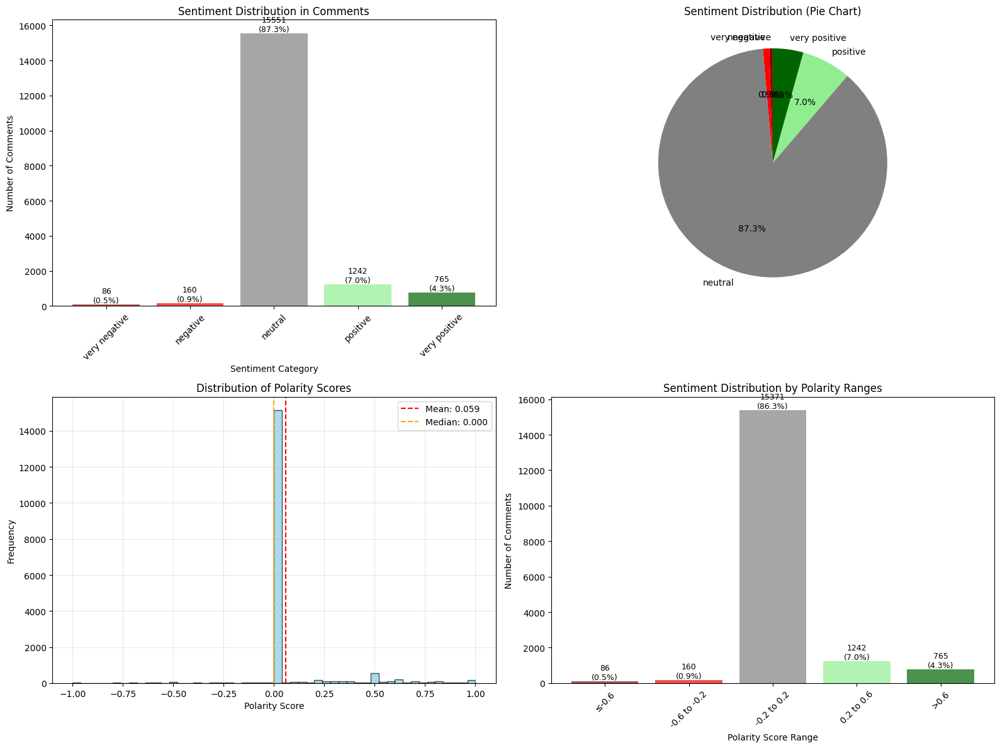
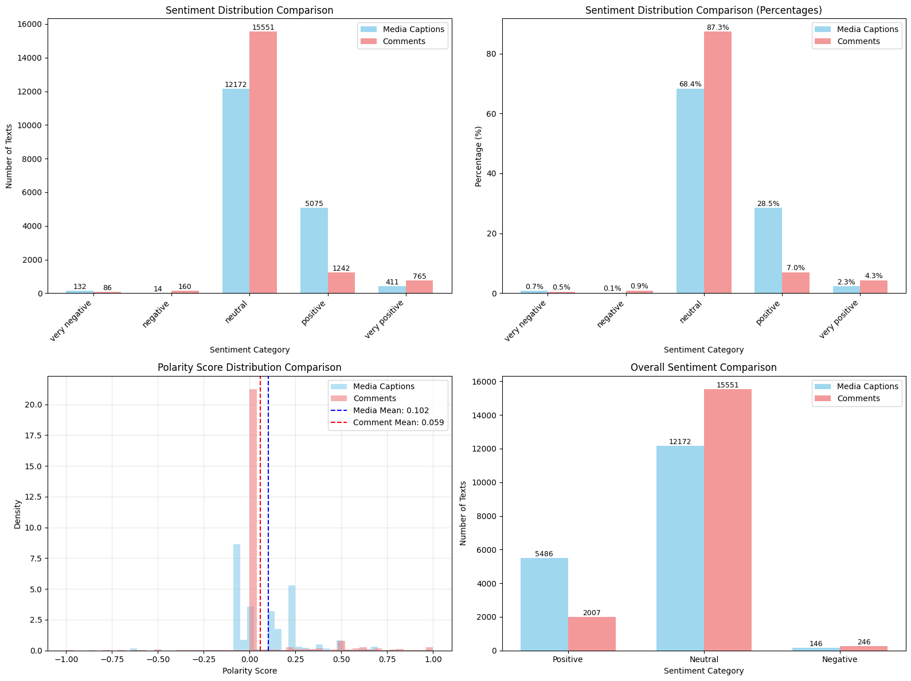

# Model Performance Insights: Comment Sentiment Prediction

## Overview
This analysis focuses on predicting comment sentiment (positive vs. negative) using a decision tree classifier. The model achieved a ROC AUC score of **0.654** after parameter tuning, indicating moderate predictive performance.

It should be noted, the exploratoy data analysis reflect that most comments are neutral, and this segment of the data should definitely be explored further.

## Model Features
The decision tree model utilized the following features for sentiment prediction:

1. **`media_caption_polarity`** - Sentiment polarity score of the media caption
2. **`has_gpe`** - Binary indicator for mentions of geopolitical entities (countries, cities, states) in media captions (17.71% of entries)
3. **`has_norp`** - Binary indicator for mentions of nationalities or religious/political groups (6.35% of entries)
4. **`has_person`** - Binary indicator for mentions of people in media captions (40.97% of entries)
5. **`has_org`** - Binary indicator for mentions of organizations in media captions (40.52% of entries)

## Model Performance Analysis

### ROC AUC Score: 0.654
The ROC AUC (Receiver Operating Characteristic Area Under the Curve) score of 0.654 provides insight into model performance:

- **Scale**: ROC AUC ranges from 0 to 1, where:
  - **1.0** = Perfect performance (100% accuracy)
  - **0.5** = No better than random chance
  - **0.0** = Perfectly wrong predictions

- **Interpretation**: Our model's score of 0.654 indicates that it provides some predictive insight beyond random chance, but there is significant room for improvement. This suggests the model captures some meaningful patterns but may be missing important features or relationships.

## Key Model Insights

### Primary Predictor: Media Caption Polarity
The decision tree structure reveals that **`media_caption_polarity`** is the most important feature for predicting comment sentiment. The model's first split occurs at a polarity threshold of 0.03, indicating that even small changes in caption sentiment have a significant impact on comment sentiment.

### Secondary Predictor: Geographic References
The second most important factor is **`has_gpe`** (geopolitical entities), which appears in the tree's second level. This suggests that mentions of countries, cities, or states in media captions are strong indicators of comment sentiment patterns.

### Model Structure
The optimized decision tree (max_depth=3, min_samples_leaf=200) shows:
- Primary split: `media_caption_polarity <= 0.03`
- Secondary split: `has_gpe <= 0.50` (for positive polarity captions)
- The model tends to predict positive sentiment across most branches

## Professional Recommendations

### 1. Model Enhancement
To improve predictive performance, consider implementing:
- **Random Forest**: Ensemble method that combines multiple decision trees to reduce overfitting and improve generalization
- **Gradient Boosting**: Sequential ensemble method that builds models to correct previous errors, often achieving superior performance

### 2. Feature Engineering
- **User Behavior Features**: Incorporate commenter-specific data such as:
  - Historical sentiment patterns of individual users
  - User engagement frequency and activity levels
  - Previous comment sentiment distribution per user
  - User demographics or profile characteristics
- Explore additional text features (word count, sentiment intensity, emotional tone)
- Consider interaction terms between existing features
- Investigate temporal patterns in sentiment
- **User Behavior Features**: Incorporate commenter-specific data such as:
  - Historical sentiment patterns of individual users
  - User engagement frequency and activity levels
  - Previous comment sentiment distribution per user
  - User demographics or profile characteristics

### 3. Further Analysis
The current model provides a foundation for understanding sentiment drivers, but additional analysis is warranted to achieve better model fit and more reliable predictions.

## Conclusion
While the decision tree model identifies meaningful patterns in comment sentiment, particularly the strong influence of media caption polarity and geographic references, the moderate ROC AUC score of 0.654 suggests opportunities for significant improvement through more sophisticated modeling approaches and enhanced feature engineering. And further analysis into neutral sentiment comments must be included.

